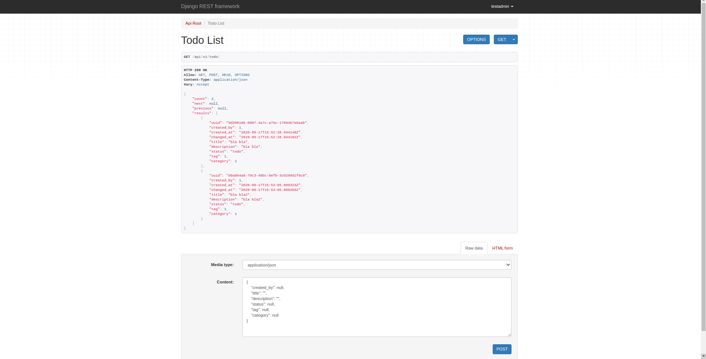

[](https://opensource.org/licenses/bsd-3-clause)
[](https://github.com/ambv/black)

# # YADRTA

__Yet Another Djando REST Todo App__ using django rest and django with [OpenAPI Specification].


_swagger_


_redoc_


_django rest api_

## ## Getting Started

This app gets requests from `localhost` on port `8000` and performs __CRUD__
operations.

Base endpoints are:
- The base endpoint is: http://localhost:8000
- `$base_url` for `api` is `/api/v1/`
- Admin panels: `/admin/`
- Authentication: `/api-auth/login/` `/api-auth/logout/`

CRUD api endpoints:
- `/api/v1/category/`
- `/api/v1/tag/`
- `/api/v1/todo/`

For documemtation:
- `/api/v1/swagger/`
- `/api/v1/swagger.yaml`
- `/api/v1/swagger.json`
- `/api/v1/redoc/`


### ### Prerequisites

- Python 3.8

### ### Installing

Clone the repo with `ssh`:

```bash
$ git clone https://github.com/SerhatTeker/yadrta.git
```

or with `https`:

```bash
$ git clone git@github.com:SerhatTeker/yadrta.git
```

### ### Getting Up and Running Locally

#### #### Setting Up Development Environment

1. Create a virtualenv:

    ```bash
    $ virtualenv -p python3.8 .venv
    ```

2. Activate the virtualenv you have just created:

    ```bash
    $ source .venv/bin/activate
    ```

3.  Install development requirements:

    ```bash
    $ pip install -r requirements.txt
    ```

4. Apply migrations:

    ```bash
    $ python manage.py migrate
    ```

5. Run Django development server:

    ```bash
    $ python manage.py runserver 8000
    ```

    or you can use __Makefile__:

    ```bash
    $ make runserver
    # or shorter : default make target is `runserver`
    # $ make
    ```

#### #### Setting Up Your Users

* To create an **superuser account**, use this command::

    ```bash
    $ python manage.py createsuperuser
    ```

    or define _environment variable_ named `DJANGO_DEV_ADMIN` and use `make
    createsuperuser`:

    ```bash
    # Create a super user from env var
    # You need to define an env var : DJANGO_DEV_ADMIN. Example below
    # DJANGO_DEV_ADMIN=name:email:password
    $ export DJANGO_DEV_ADMIN=testadmin@test.api:testadmin@test.api:123asX3?23
    $ make createsuperuser
    ```

* To create a **normal user account**, just sign in as __superuser__ into
 __Admin Module__ (`/admin/`) and create a new user.

#### #### Login

Use one of the below endpoints:

- `/admin/`
- `/api-auth/login/`

#### #### Summary

Congratulations, you have made it!

## ## Usage

Activate _virtual environment_ and run _django development server_:

```bash
$ source .venv/bin/activate
$ python manage.py runserver 8000
```

Use `cli` tools like `curl` or [httpie]:

`curl`:

```bash
$ curl -H 'Accept: application/json; indent=4' -u testadmin:123asX3?23 http://127.0.0.1:8000/api/v1/todo/
```

`httpie`:

```bash
$ http -a testadmin:123asX3?23 http://127.0.0.1:8000/api/v1/todo/
```

after those you will get below _todo sample api response_:

### ### Sample API Responses

`/category/`

```json
{
    "count": 2,
    "next": null,
    "previous": null,
    "results": [
        {
            "uuid": "25696439-a580-4489-9e5a-6172d0954430",
            "created_by": 1,
            "created_at": "2020-09-17T15:51:26.527025Z",
            "changed_at": "2020-09-17T15:51:26.527058Z",
            "name": "business"
        },
        {
            "uuid": "89e875b3-ae1d-4a91-a8d0-b4975127d97f",
            "created_by": 1,
            "created_at": "2020-09-17T15:51:38.682076Z",
            "changed_at": "2020-09-17T15:51:38.682147Z",
            "name": "learning"
        }
    ]
}
```

`/tag/`

```json
{
    "count": 2,
    "next": null,
    "previous": null,
    "results": [
        {
            "uuid": "d1911f18-8a49-457c-aa72-b1e9ae9e198d",
            "created_by": 1,
            "created_at": "2020-09-17T15:49:42.392670Z",
            "changed_at": "2020-09-17T15:49:42.392730Z",
            "name": "newthing"
        },
        {
            "uuid": "a95acc20-483c-43de-83e7-c6fe44ba4f2e",
            "created_by": 1,
            "created_at": "2020-09-17T15:49:56.709027Z",
            "changed_at": "2020-09-17T15:49:56.709064Z",
            "name": "language"
        }
    ]
}
```

`/todo/`

```json
{
    "count": 2,
    "next": null,
    "previous": null,
    "results": [
        {
            "uuid": "9d208186-0987-4a7c-a75c-17094b7e6aab",
            "created_by": 1,
            "created_at": "2020-09-17T15:52:28.944148Z",
            "changed_at": "2020-09-17T15:52:28.944182Z",
            "title": "bla bla",
            "description": "bla bla",
            "status": "todo",
            "tag": 1,
            "category": 1
        },
        {
            "uuid": "d9a804a6-79c3-40bc-befb-3c0290d1f0c8",
            "created_by": 1,
            "created_at": "2020-09-17T15:53:05.809323Z",
            "changed_at": "2020-09-17T15:53:05.809356Z",
            "title": "bla bla2",
            "description": "bla bla2",
            "status": "todo",
            "tag": 1,
            "category": 1
        }
    ]
}
```

## Versioning

We use [SemVer](http://semver.org/) for versioning. For the versions available,
see the [tags on this repository](https://github.com/serhatteker/yadrta/tags).

## Authors

* **Serhat Teker** - *Initial work* - [serhatteker](https://github.com/serhatteker)

## License

This project is licensed under the BSD-3-Clause License - see the
[LICENSE.md](LICENSE.md) file for details.


[httpie]: https://github.com/httpie/httpie
[OpenAPI Specification]: https://swagger.io/specification/
