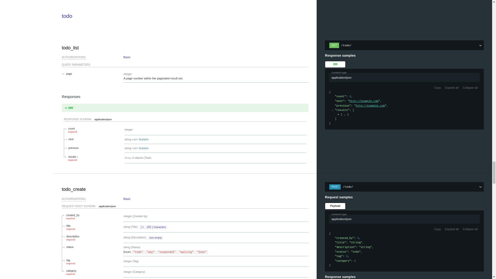

[](https://opensource.org/licenses/bsd-3-clause)
[](https://github.com/ambv/black)
[](https://codecov.io/github/SerhatTeker/yadrta?branch=master)
[](https://travis-ci.com/SerhatTeker/yadrta)

# YADRTA

__Yet Another Djando REST Todo App__ using django rest and django with [OpenAPI Specification].
The purpose of this project is to show minimal best practices including tests.

**Demo:** https://yadrta.herokuapp.com


_swagger_


_redoc_


_django rest api_

## Table of Contents

* [Table of Contents](#table-of-contents)
* [General](#general)
  * [Endpoints](#endpoints)
  * [Branches](#branches)
  * [Prerequisites](#prerequisites)
* [Getting Up and Running Locally](#getting-up-and-running-locally)
  * [Installing](#installing)
  * [Setting Up Development Environment](#setting-up-development-environment)
  * [Code Quality](#code-quality)
  * [Summary](#summary)
* [Usage](#usage)
  * [Authentication](#authentication)
    * [Create User](#create-user)
    * [Create Superuser](#create-superuser)
    * [Getting User Token](#getting-user-token)
    * [Login](#login)
  * [API v1](#api-v1)
    * [Sample API Responses](#sample-api-responses)
* [Testing](#testing)
  * [Test Coverage](#test-coverage)
* [Versioning](#versioning)
* [Authors](#authors)
* [License](#license)

## General

### Endpoints

This app gets requests from `localhost` on port `8000` and performs __CRUD__
operations.

Base endpoints are:
- The base endpoint is: http://localhost:8000
- `base_url` for __API v1__ is `/api/v1/`
- Session Authentication: `/api-auth/login/` `/api-auth/logout/`
- Admin panels: `/admin/`

__CRUD API__ endpoints:

- `/api/v1/category/`
- `/api/v1/tag/`
- `/api/v1/todo/`

For documemtation:
- `/api/v1/doc/swagger/`
- `/api/v1/doc/swagger.yaml`
- `/api/v1/doc/swagger.json`
- `/api/v1/doc/redoc/`

### Branches

- [master] - default branch
- [basic] - using django's default basic structure
- [local] - just for local development

### Prerequisites

- Python 3.8

## Getting Up and Running Locally

### Installing

Clone the repo with `ssh`:

```bash
$ git clone https://github.com/SerhatTeker/yadrta.git
```

or with `https`:

```bash
$ git clone git@github.com:SerhatTeker/yadrta.git
```

### Setting Up Development Environment

1. Create a virtualenv:

    ```bash
    $ virtualenv -p python3.8 .venv
    ```

2. Activate the virtualenv you have just created:

    ```bash
    $ source .venv/bin/activate
    ```

3.  Install development requirements:

    ```bash
    $ pip install -r requirements/local.txt
    ```

4. Apply migrations:

    ```bash
    $ python manage.py migrate
    ```

5. Run Django development server:

    ```bash
    $ python manage.py runserver 8000
    ```

    or you can use __Makefile__:

    ```bash
    $ make runserver
    # or shorter : default make target is `runserver`
    # $ make
    ```

### Code Quality

For code quality this repo uses [pre-commit]: A framework for managing and
maintaining multi-language pre-commit hooks.

Configuration file can be found:
[.pre-commit-config.yaml](./.pre-commit-config.yaml).

To install the git hook script run:

```bash
$ pre-commit install
```

Now `pre-commit` will run automatically on `git commit`!

### Summary

Congratulations, you have made it!

## Usage

Activate _virtual environment_ and run _django development server_:

```bash
$ source .venv/bin/activate
$ python manage.py runserver 8000
```

### Authentication

This app uses 2 different `auth` methods:

- [Session Authentication]
- [Token Authentication]

#### Create User

```bash
$ curl -d '{"username":"testuser", "password":"testuser", "email":"testuser@testapi.com"}' \
	     -H "Content-Type: application/json" \
	     -X POST http://localhost:8000/api/v1/users/
```

#### Create Superuser

1. From `manage.py` cli utility tool:

```bash
$ python manage.py createsuperuser --username testdamin --email testadmin@testapi.com
```

2. From `make` target:

First you need to define the environment variable : `DJANGO_DEV_ADMIN`.

```bash
# DJANGO_DEV_ADMIN=name:email:password
DJANGO_DEV_ADMIN=testadmin:testadmin@testapi.com:123asX3?23
```

Then run;

```bash
$ make createsuperuser
```

which will run:

```make
createsuperuser:
	@echo "from django.contrib.auth import get_user_model; User = get_user_model(); User.objects.create_superuser(*'${DJANGO_DEV_ADMIN}'.split(':'))" | python manage.py shell
```

#### Getting User Token

Run :

```bash
$ http http://localhost:8000/api-token-auth/ username=testuser password=testuser
```

Output will be like:

```bash
HTTP/1.1 200 OK
Allow: POST, OPTIONS
Content-Length: 52
Content-Type: application/json
Date: Tue, 22 Sep 2020 13:57:46 GMT
Referrer-Policy: same-origin
Server: WSGIServer/0.2 CPython/3.8.1
Vary: Cookie
X-Content-Type-Options: nosniff
X-Frame-Options: DENY

{
    "token": "80ca0dadab06b34623a6b8279320e8341e2a5102"
}
```

#### Login

Use one of the below endpoints:

- `/admin/`
- `/api-auth/login/`

###  API v1

`curl`:

```bash
$ curl -X GET http://localhost:8000/api/v1/todo/ \
		-H 'Authorization: Token <user_token>' \
		-H 'Accept: application/json; indent=4'
```

After those you will get below _todo sample api response_:

#### Sample API Responses

- `/category/`


```json
{
    "count": 2,
    "next": null,
    "previous": null,
    "results": [
        {
            "name": "business",
            "pk": 1,
            "uuid": "d1911f18-8a49-457c-aa72-b1e9ae9e198d",
            "created_by": "1809d5b4-4b71-4b68-9221-73af7a2e221d",
            "created_at": "2020-09-17T15:49:42.392670Z",
            "changed_at": "2020-09-17T15:49:42.392730Z",
        },
        {
            "name": "post",
            "pk": 2,
            "uuid": "d1911f18-8a49-457c-aa72-b1e9ae9e198d",
            "created_by": "1809d5b4-4b71-4b68-9221-73af7a2e221d",
            "created_at": "2020-09-17T15:49:42.392670Z",
            "changed_at": "2020-09-17T15:49:42.392730Z",
        }
    ]
}
```

- `/tag/`

```json
{
    "count": 2,
    "next": null,
    "previous": null,
    "results": [
        {
            "name": "newthing",
            "pk": 1,
            "uuid": "d1911f18-8a49-457c-aa72-b1e9ae9e198d",
            "created_by": "1809d5b4-4b71-4b68-9221-73af7a2e221d",
            "created_at": "2020-09-17T15:49:42.392670Z",
            "changed_at": "2020-09-17T15:49:42.392730Z",
        },
        {
            "name": "language",
            "pk": 2,
            "uuid": "d1911f18-8a49-457c-aa72-b1e9ae9e198d",
            "created_by": "1809d5b4-4b71-4b68-9221-73af7a2e221d",
            "created_at": "2020-09-17T15:49:42.392670Z",
            "changed_at": "2020-09-17T15:49:42.392730Z",
        }
    ]
}
```

- `/todo/`

```json
{
    "count": 2,
    "next": null,
    "previous": null,
    "results": [
        {
            "pk": 1,
            "description": "bla bla",
            "uuid": "9d208186-0987-4a7c-a75c-17094b7e6aab",
            "title": "bla bla",
            "status": "todo",
            "tag": 1,
            "category": 1,
            "created_by": "1809d5b4-4b71-4b68-9221-73af7a2e221d",
            "created_at": "2020-09-17T15:52:28.944148Z",
            "changed_at": "2020-09-17T15:52:28.944182Z",
        },
        {
            "pk": 2,
            "title": "bla bla2",
            "description": "bla bla2",
            "status": "todo",
            "tag": 1,
            "category": 1,
            "uuid": "d9a804a6-79c3-40bc-befb-3c0290d1f0c8",
            "created_by": "1809d5b4-4b71-4b68-9221-73af7a2e221d",
            "created_at": "2020-09-17T15:53:05.809323Z",
            "changed_at": "2020-09-17T15:53:05.809356Z",
        }
    ]
}
```

## Testing

Install requirements:

```bash
$ pip install -r requirements/local.txt
```

Run tests:

```bash
$ pytest
```

### Test Coverage

Current test coverage:
[](https://codecov.io/github/SerhatTeker/yadrta?branch=master)

For a detail report: https://codecov.io/github/SerhatTeker/yadrta?branch=master

## Versioning

I use [SemVer](http://semver.org/) for versioning. For the versions available,
see the [tags on this repository](https://github.com/serhatteker/yadrta/tags).

## Authors

* **Serhat Teker** [serhatteker](https://github.com/serhatteker)

## License

This project is licensed under the BSD-3-Clause License - see the
[LICENSE](LICENSE) file for details.


[httpie]: https://github.com/httpie/httpie
[OpenAPI Specification]: https://swagger.io/specification/
[Session Authentication]: https://www.django-rest-framework.org/api-guide/authentication/#sessionauthentication
[Token Authentication]: https://www.django-rest-framework.org/api-guide/authentication/#tokenauthentication
[master]: https://github.com/SerhatTeker/yadrta/tree/master
[basic]: https://github.com/SerhatTeker/yadrta/tree/basic
[local]: https://github.com/SerhatTeker/yadrta/tree/local
[deployment]: https://github.com/SerhatTeker/yadrta/tree/deployment
[pytest]: https://github.com/SerhatTeker/yadrta/tree/pytest
[pre-commit]: https://pre-commit.com/
